# 通过以下二维吗购买的极客时间课程，返现3/4。

### 查看返现金额： 极客时间APP > 我的 > 分享有赏 > 
### 比如Java核心技术36讲 > 成功邀请得24元，那么请联系下面的微信，找我给你返现16元。
### 友情提醒：极客时间搞拼团，限时优惠等，一样可以找我返现。
### 我的微信号搜索:  【zgpeace】   或者扫描下面二维码

### 课程二维码如下：
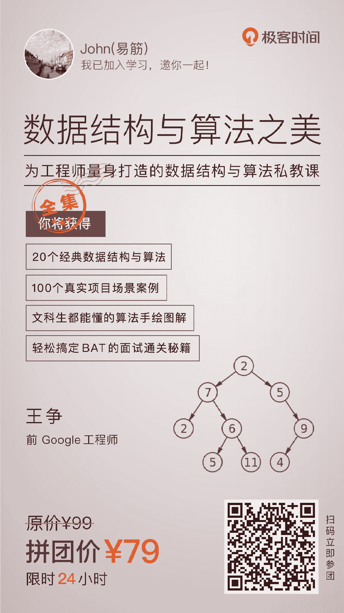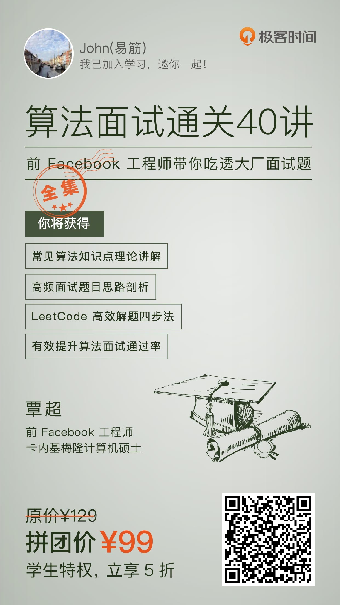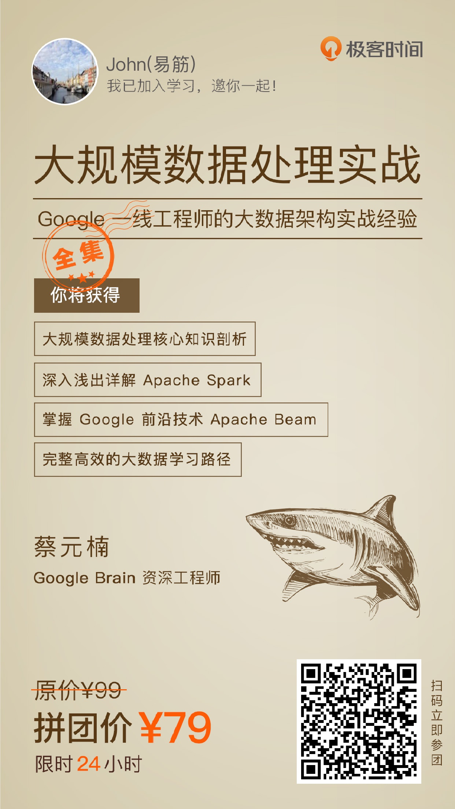

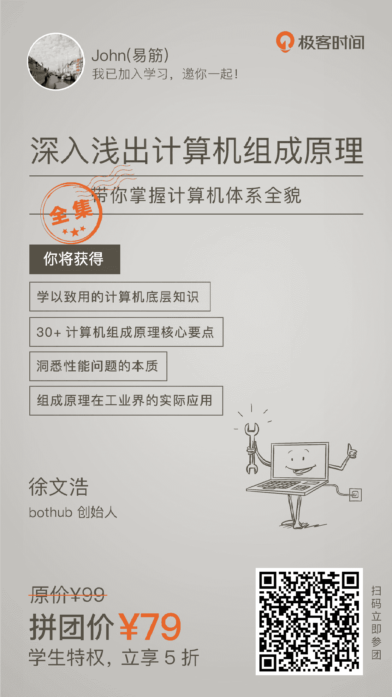
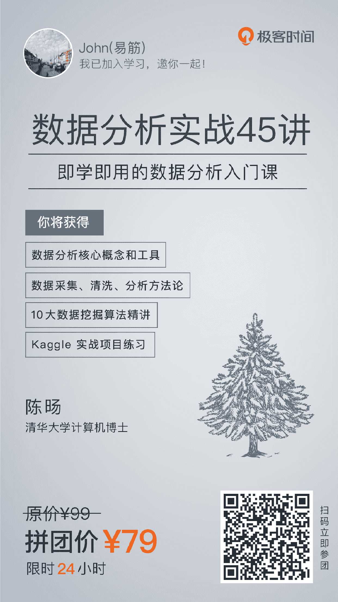
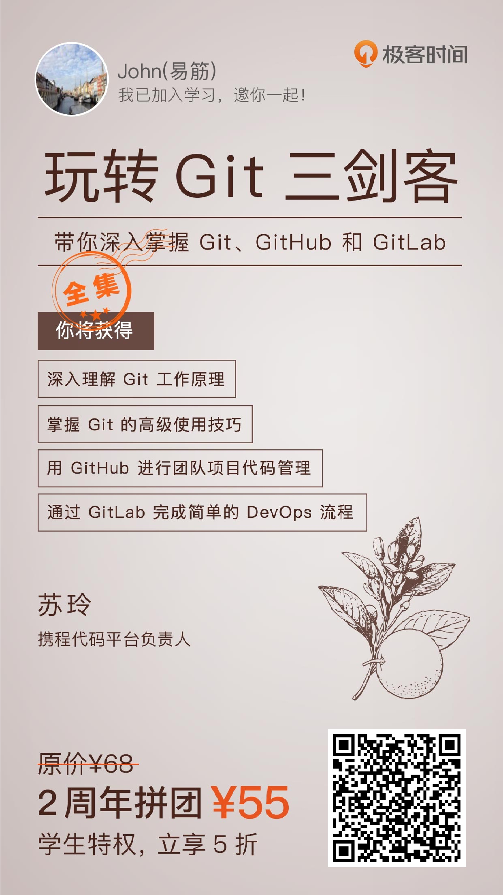

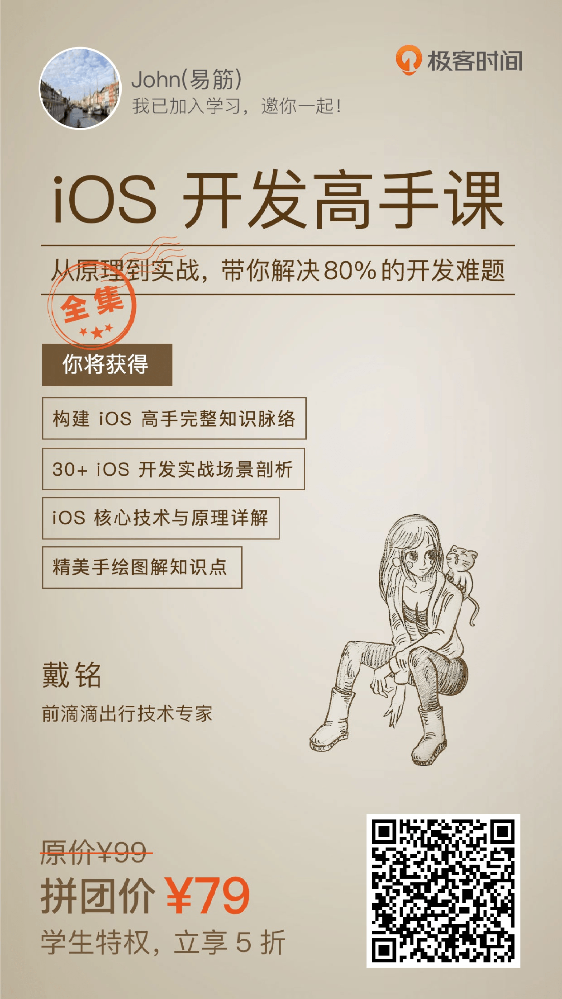

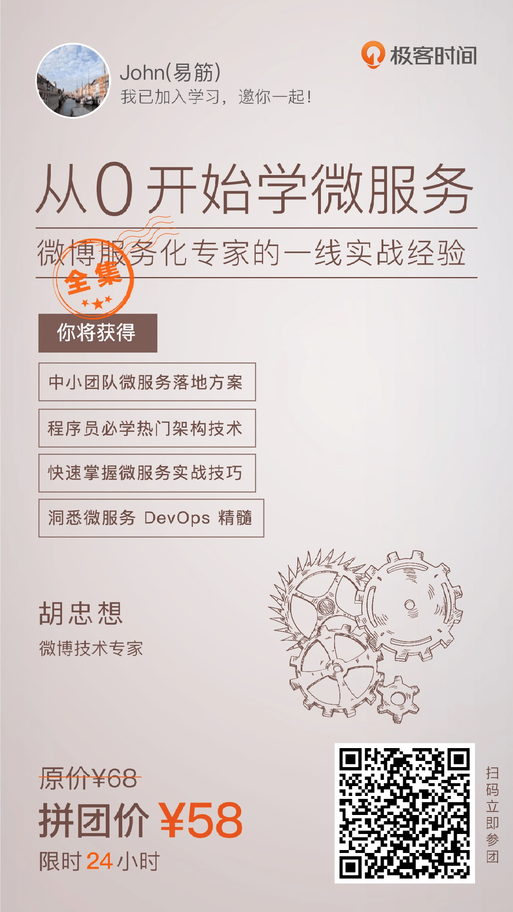
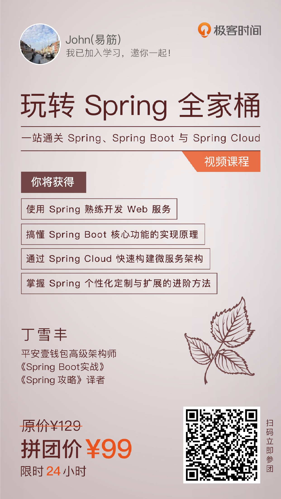
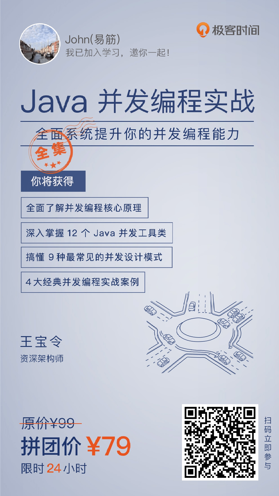
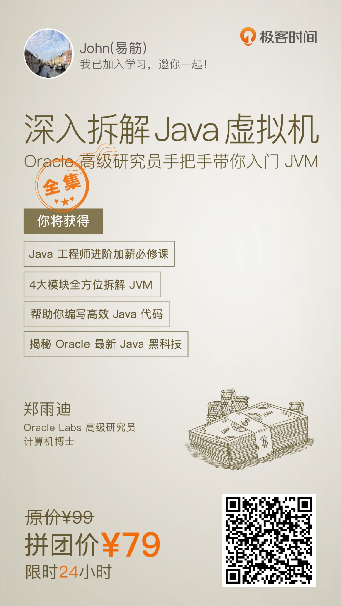
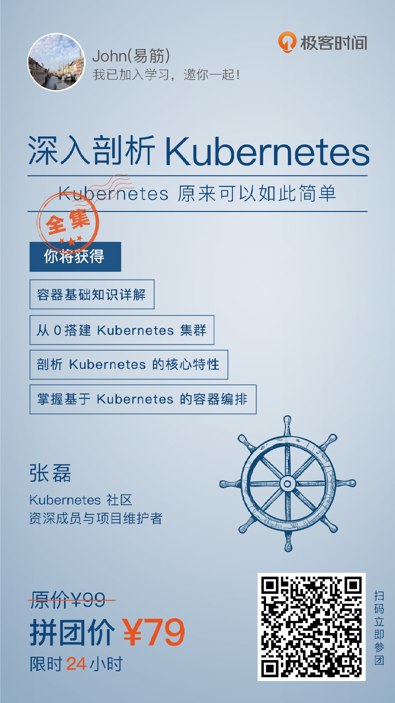
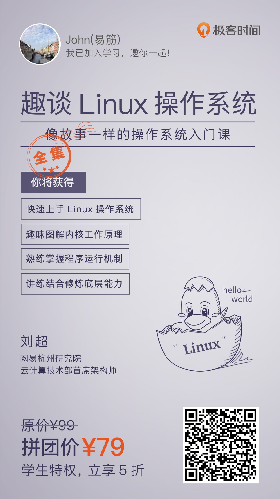
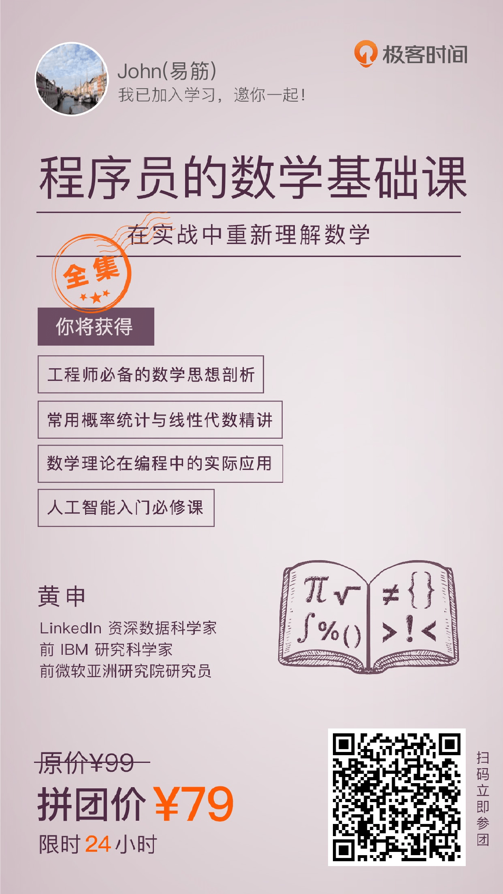

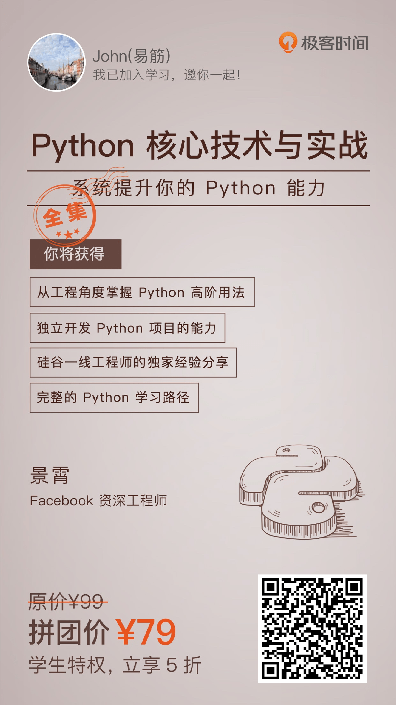

